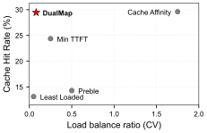
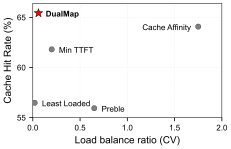
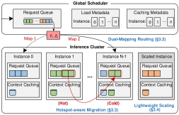
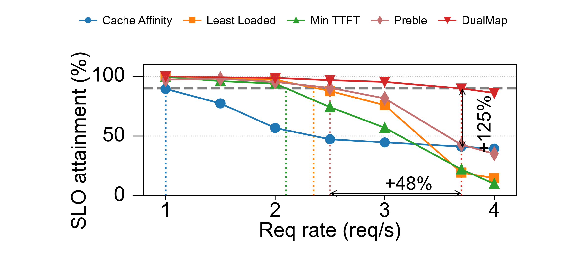
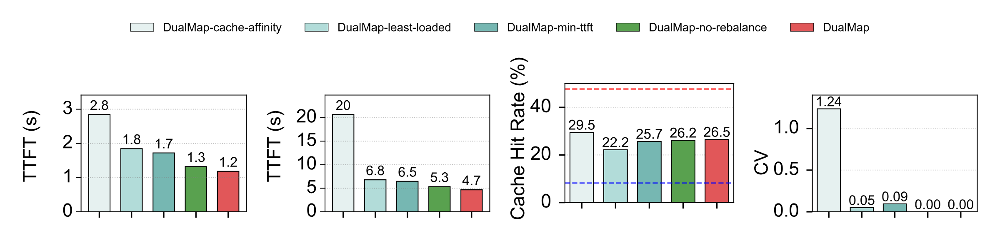

# DualMap

> 论文速读报告。主要依据 [arXiv:2602.06502](https://arxiv.org/abs/2602.06502) 的 v1 版本（提交于 2026-02-06），已核对摘要、正文、附录、表格、图注与 LaTeX 源文件。除 arXiv 元数据外，本报告未使用外部材料；文中章节、Figure 和 Table 均指该版本论文。

## 核心结论速览

- **Motivation：** 分布式 LLM serving 中，按 prefix 路由能增加 KV cache 复用，却会让热门 prefix 把少数实例变成热点；按负载路由能均衡队列，却会打散共享 prefix。已有方法在单一映射空间中切换两类目标，缺少稳定的局部分流空间。
- **Contribution**
  - **Idea：** DualMap 先用 prompt prefix 的两个独立 hash 为请求绑定两个稳定候选实例，平时优先复用 cache，只有预计 TTFT 将超过 SLO 时才分流；再用候选对内迁移处理热点，用双 hash ring 处理扩缩容。
  - **Evaluation：** 在两条 Mooncake 真实 trace、Qwen2.5-7B/14B 和 8 个 NPU 实例上，DualMap 相比最佳 baseline 将 effective request capacity 最多提高 125%（即达到 2.25 倍），且消融实验显示 SLO-aware routing 与 hotspot-aware rebalancing 各有独立作用；但 8→32 实例的规模结论来自模拟器，真实集群只验证到 8 实例。

## 论文基本信息

| 项目 | 内容 |
|---|---|
| 标题 | DualMap: Enabling Both Cache Affinity and Load Balancing for Distributed LLM Serving |
| 作者 / 年份 | Ying Yuan, Pengfei Zuo, Bo Wang, Zhangyu Chen, Zhipeng Tan, Zhou Yu / 2026 |
| 领域 / 任务 | Distributed LLM serving；KV cache 复用、请求调度、负载均衡与 TTFT SLO |
| 输入来源 | [arXiv 摘要页](https://arxiv.org/abs/2602.06502)、[PDF](https://arxiv.org/pdf/2602.06502v1)、[HTML 正文](https://arxiv.org/html/2602.06502v1)、[LaTeX 源码](https://arxiv.org/src/2602.06502v1)；解析为 v1，LaTeX 源码与 HTML 图像获取成功 |
| 一句话问题定义 | 在分布式 LLM 推理中，如何既让共享 prefix 的请求复用 KV cache，又避免热门 prefix 压垮少数实例，从而让更多请求满足 TTFT SLO？ |

## Motivation

### 背景与任务

LLM 推理先在 **prefill** 阶段处理整个 prompt 并生成 KV cache，再进入逐 token 的 decode。多轮对话会重复历史消息，tool-agent 请求会重复 system prompt 和工具说明；若新请求与旧请求共享 prefix，就可以复用对应 KV cache，省去重复 prefill 计算。

分布式部署同时引入实例间排队。因此论文关注的不是单纯吞吐，而是满足 **TTFT（time-to-first-token，首 token 延迟）SLO** 的请求比例，即 effective request capacity。主实验将 TTFT 小于 5 秒作为 SLO。

### 当前方法已经做到什么

- **Cache Affinity：** 把请求送到拥有最多相关 KV cache 的实例。共享 prefix 被集中起来，命中率高，但热门 prefix 会造成流量集中。
- **Least Loaded：** 按 pending prefill tokens 选择当前最空的实例。队列更均匀，但共享 prefix 被打散，cache miss 和重复计算增多。
- **Min TTFT：** 同时估计排队时间与 cache reuse 后的计算时间，逐请求选择预计 TTFT 更低的实例；论文用它简化代表 Mooncake 的请求调度。
- **Preble：** prefix hit rate 超过 50% 时启用 prompt-aware routing，否则根据计算成本与负载选择实例。

这些方法覆盖了“缓存优先”“负载优先”以及对两者做动态权衡的主要思路（§2.2）。

### 关键瓶颈或矛盾

缓存亲和与负载均衡依赖不同信号：前者问“需要的 KV cache 在哪里”，后者问“哪里现在更空”。把一个 prefix 固定到单一实例，保住了 cache，却没有分流余地；允许请求在整个集群中追逐低负载，又会破坏 prefix 共置。

论文将这种结构性限制概括为 **single mapping space**：已有策略可以在两种目标间切换，但每次切换仍会牺牲其中一端，也容易因短期负载波动而反复改变路由。

### 论文观察到的现象与证据

Figure 1 在 8 实例、Qwen2.5-7B 上直接画出了冲突：横轴是 pending prefill tokens 的变异系数 CV（越低越均衡），纵轴是 cache hit rate。Cache Affinity 命中更高但负载更失衡，Least Loaded 更均衡但命中更低；Min TTFT 和 Preble 介于两者之间。Conversation 上 Cache Affinity 的命中率是 Least Loaded 的 1.21 倍；Tool&Agent 上前者接近理论上限，后者接近下限（§2.2）。

| Conversation | Tool&Agent |
|---|---|
|  |  |

> 来源：原论文 Figure 1(a)(b)。读图重点：这是两个目标的 Pareto 冲突，而不是单一指标上的优劣；已有折中策略没有同时到达高命中、低 CV 的区域。

论文还用 workload 统计说明 cache affinity 有现实价值：Table 1 中 Conversation 与 Tool&Agent 的 prefix caching ratio 分别为 40% 和 59%；Figure 14 中，48% 的 Conversation 请求、76% 的 Tool&Agent 请求至少共享一半 prompt prefix。另一方面，Figure 8 显示真实 prefix 热度偏斜会让 Tool&Agent 仍出现持续热点。因此，双候选是必要的分流结构，但不是充分的热点解决方案。

### 从现象到研究问题

由上述现象可推导出四个子问题：

1. 如何为同一 prefix 提供少量但稳定的分流位置，避免在整个集群中打散 cache？
2. 如何选择 hash 所用的 prefix 长度，避免过长损伤复用、过短聚集热点？
3. 如何只在 SLO 受威胁时牺牲部分 cache reuse，并在两个候选都热时处理队列？
4. 如何在实例增删时避免全局 remap？

它们共同要求一个“受 prefix 约束、但又能读取实时系统状态”的局部候选空间。

### 为什么已有方案不足

纯 Cache Affinity 和纯 Least Loaded 分别优化两个极端。Min TTFT 虽综合排队与重算成本，却逐请求追求瞬时最优；负载波动时，它可能在有 cache 的实例与较空实例间反复摇摆，引入新的 cache miss。Preble 依赖固定的 50% hit-rate 条件切换模式，也没有为同一 prefix 建立稳定且可分流的候选集合。

DualMap 的关键区别是先改变映射结构，把可选位置从一个变成两个；然后才在这个局部空间中做 SLO-aware 选择。

### 研究目标与隐含假设

**论文明确目标：** 在 TTFT SLO 约束下，以双映射调度同时改善 KV cache affinity 和实例负载分布，并在偏斜流量与弹性扩缩容时继续工作。

**根据机制推断的前提：** workload 中存在足够且可由 prefix 识别的复用；global scheduler 能及时获得候选实例的 KV cache 元数据、pending prefill tokens 和最近 prefill 完成状态；基于这些状态的 TTFT/过载估计足以支持路由。若几乎没有共享 prefix，或主要成本来自 decode 而非 prefill，收益空间会变小。

## Contribution 👉 Idea

### 整体直觉

DualMap 不再让一个 prefix 只有一个落点，也不让它在整个集群中任意漂移，而是将它稳定映射到两个候选。正常情况下选择 cache reuse 更多的候选；只有继续排队可能违反 TTFT SLO 时，才切换到较空候选。这样，缓存粘性和分流能力被关在一个小而稳定的选择空间中。

> 来源：原论文 Figure 2。读图重点：DualMap 是 vLLM 之上的独立 global scheduling layer；它不修改模型推理逻辑，而是依赖 cache 与队列元数据决定请求去哪个实例。

- **输入：** 请求 prompt prefix、实例集合、各实例 KV cache 元数据、pending prefill tokens、最近 prefill 状态与 TTFT SLO。
- **处理：** 自适应选取 hash prefix；双 hash 生成两个候选；根据 cache reuse、负载与 SLO 路由；必要时在候选对内迁移；扩缩容时用一致性 hash ring 局部更新映射。
- **输出：** 请求的承载实例，以及负载变化和实例增删时相对稳定的 prefix-to-candidate 映射。

### 机制拆解

#### 机制 1：Prefix-bound dual candidates 与自适应 hash prefix

**解决的问题：** 单候选没有分流余地；hash key 过长会把本应共享 cache 的请求分开，过短则会让不相关请求或超热 prefix 聚集在少数实例。

**怎么做：** scheduler 维护 prefix hotness tree，用滑动窗口内共享某 prefix 的请求比例 ρ 表示热度。当 ρ > 2/n（n 为实例数）时增加子节点、延长 hash key；当热度降至 ρ < 1/n 时移除子节点、缩短 key。得到的 prefix 分别输入独立的 f1、f2，生成两个候选；若两次 hash 碰撞到同一实例，就把第二候选确定性调整为相邻实例（§3.2）。

附录 Figure 6 给出行为证据：Conversation 有 95% 的请求使用 2 个 block 的 hash key；Tool&Agent 中 45.2% 使用 2 blocks，另有 14.9% 和 37.8% 因两个异常热门 prefix 被延长到 6 和 13 blocks。这里一个 block 是 512 tokens。

**为什么可能有效：** 共享 prefix 会反复落到同一候选对，保留局部性；两个候选又提供有限分流能力。Figure 15 的 PoTC 理论计算显示，候选数从 1 增至 2 时最大负载偏差大幅下降，超过 2 后边际收益快速减小。但这项保证依赖候选近似均匀随机，真实偏斜 workload 仍需要机制 3。

**与 baseline 的区别：** Cache Affinity 通常给 prefix 一个主要位置，Least Loaded 则在更大实例集合中追逐当前低负载；DualMap 固定两个 prefix-bound 候选，并动态调整用于绑定候选的 prefix 粒度。

#### 机制 2：SLO-aware request routing

**解决的问题：** 只选 cache hit 更高的实例会排长队；只选较空实例会重复 prefill；逐请求最小化预计 TTFT 又可能随短期负载反复切换。

**怎么做：** 对请求 r 和候选实例 i，论文将预计首 token 延迟写为：

TTFT(r,i) = Tq(r,i) + Tc(r,i)

其中 Tq 是排队时间，Tc 是考虑 cache reuse 后的计算时间。DualMap 默认选择复用最多的候选；只有该候选的负载会使预计 TTFT 超过 SLO 时，才切到较空候选。实现中用“一个 NPU 能在 SLO 内处理的最大 pending prefill tokens”作为 ttft_slo_threshold；若两个候选 hit rate 相同，直接选较空者（§3.2）。

**为什么可能有效：** 决策目标从“每个请求都追求瞬时最低 TTFT”变为“只要仍能满足 SLO，就维持 cache affinity”，从而减少不必要的切换和重算，把分流留给真正接近违约的时刻。

**与 baseline 的区别：** Min TTFT 每次选预测值更小的候选；DualMap 把 cache affinity 设为默认状态，把 SLO 违约风险设为切换条件。

#### 机制 3：Hotspot-aware request rebalancing

**解决的问题：** 真实 prefix 热度偏斜时，候选对并非均匀随机；两个候选甚至可能同时过载，单靠初始路由不足以控制尾延迟。

**怎么做：** 初始路由发现两个候选均过载时，scheduler 检查过载实例的队列。对队中请求 r 从当前候选 i 迁移到备用候选 j，计算迁移收益：

B(r, i→j) = TTFT(r,i) − TTFT(r,j)

只有 B > 0 且目标侧预计 TTFT(r,j) < TTFT_SLO 的请求才可迁移。系统按收益降序做单轮批量迁移，直到源队列中的请求预计都能满足 SLO。迁移目标严格限于该请求原有的另一个候选，不做全局搜索（§3.3、附录 A.1）。

**为什么可能有效：** 迁移收益同时计入源、目标两侧的排队和 cache miss 计算代价；候选对约束控制搜索成本并减少 prefix 扩散。设计借鉴 Cuckoo hashing 的备用槽位，但不做递归驱逐。

**与 baseline 的区别：** 这不是只按队尾、目标负载或 cache hit 单一信号迁移，而是用 TTFT 净收益筛选，并保留原候选映射。

#### 机制 4：Lightweight dual-hash-ring scaling

**解决的问题：** 类似 hash(prefix) mod n 的静态映射在实例数变化时会大范围改写 prefix-to-instance 关系，使已有 KV cache 失效并产生服务抖动。

**怎么做：** 实例根据唯一标识放入逻辑一致性 hash ring；prefix 经两个独立 hash 得到两个环上位置，每个位置选择顺时针最近实例作为候选。实例加入或移除时，只改变相邻环区间的映射，之后仍由 SLO-aware routing 在两候选间决策（§3.4）。

**为什么可能有效：** 未落入受影响区间的 prefix 保持原候选路径，大部分 cache locality 不必因扩缩容重建。

**与 baseline 的区别：** 经典 consistent hashing 通常为 key 找一个后继位置；DualMap 同时保留两个 prefix-bound 后继候选，并叠加运行时状态选择。

## Contribution 👉 Evaluation

### 实验配置

DualMap 作为独立 global scheduling layer 部署在 vLLM 之上。主实验使用 8 个实例，每实例独占一个 Ascend NPU；节点各有 8 个 NPU 与 1.5 TB DRAM。Qwen2.5-7B 使用 910B4（32 GB HBM），Qwen2.5-14B 使用 910B3（64 GB HBM），均为 float16。论文未说明主实验的节点数和网络互连配置。7B/14B 的 context cache 上限分别为 100 万/50 万 tokens，约覆盖全部请求 tokens 的 30%/15%（§4.1）。

| Workload | 场景与 prefix 特征 | 请求数 | 平均输入 / 输出长度 |
|---|---|---:|---:|
| Conversation | 多轮 chatbot；prefix caching ratio 约 40% | 4,000 | 12,035 / 343 tokens |
| Tool&Agent | 长且重复的 system/tool prompt；prefix caching ratio 59% | 8,000 | 8,596 / 182 tokens |

两条 trace 均来自 Mooncake。实验保留并缩放原始到达时间以构造不同 QPS；7B/14B 的单请求输入分别截断到 20,480/10,240 tokens；前 500 个请求仅用于 warm-up，不计入结果（Table 1、附录 A.2.1）。

主要指标包括：TTFT 小于 5 秒的请求比例（Effective Request Capacity）、在指定 SLO 达标率下可持续的峰值 QPS（Goodput，论文以 90% 为例）、P50/P90 TTFT、P50/P90 E2E latency、Cache Hit Rate，以及基于 pending prefill tokens 的负载分布/CV。

### Baseline 分组

| Baseline | 代表思路 | 比较目的 |
|---|---|---|
| Cache Affinity | 最大化 prompt/cache 共置 | 观察高 cache reuse 但缺少分流的一端 |
| Least Loaded | 只按 pending prefill load 选实例 | 观察负载最均匀但 cache reuse 较弱的一端 |
| Min TTFT | 逐请求综合排队与重算成本 | 对比瞬时 cost-based 选择；作为 Mooncake 调度的简化表示 |
| Preble | 以 prefix hit 条件切换 prompt-aware 与 load-aware 选择 | 对比已有条件式折中策略 |

论文未将 NVIDIA Dynamo 单列为 baseline，理由是其 cost-based 设计与 Mooncake 相似（§2.2）。因此“相比 state of the art”的实验依据应理解为相比表中这四类实现，而不是对所有生产调度器的穷尽比较。

### 实验分析

#### 主结果：Figure 3–4

Figure 3 在两种 workload、两种模型上改变 QPS，比较满足 5 秒 TTFT SLO 的请求比例和 Goodput。Tool&Agent 的 prefix 更偏斜，Cache Affinity 即使在较低 QPS 下也会因热点排队而丢失 SLO；DualMap 在所测 QPS 下保持更高达标率。相对最佳 baseline，Tool&Agent 的 effective request capacity 最多提高 125%，Goodput 提高 16.7%–48%；Conversation 中对应区间为 40.6%–80% 和 14.3%–40%（§4.2）。

> 来源：原论文 Figure 3(b)。读图重点：横轴是 QPS，纵轴是 TTFT < 5s 的请求比例；该子图是“最多提高 125%”的直接证据位置。它支持 DualMap 对偏斜 Tool&Agent trace 的结论，不能单独代表其他模型、硬件或 workload。

Figure 4 进一步显示，高 QPS 下 DualMap 相比最佳 baseline 将 P50 TTFT 降低 55.4%–97.4%，P90 TTFT 降低 82.3%–97%，E2E latency 呈相似趋势。其含义是收益不只出现在平均吞吐，也体现在排队尾部；但这些较大的百分比是论文在指定高 QPS 点报告的相对降幅，不应理解为所有负载下的固定收益。

**本组结论：** 双候选调度将 cache 与负载的改善转化为更高 SLO 达标率和更低尾延迟，且在论文的两种模型与两条 trace 中方向一致。

#### 消融：Figure 5

消融实验固定为 Conversation + Qwen2.5-14B，依次比较双候选内的 cache-affinity、least-loaded、min-TTFT、启用 SLO-aware 但关闭 rebalancing 的 DualMap-no-rebalance，以及完整 DualMap。

> 来源：原论文 Figure 5(a)–(d)。读图重点：DualMap-cache-affinity 命中高但排队失衡，DualMap-least-loaded 反之；相比 DualMap-min-ttft，只加 SLO-aware routing 的 no-rebalance 将 P50/P90 TTFT 降低 23.5%/18.5%，完整 DualMap 的 rebalancing 再将 P90 降低 11.3%。

**本组结论：** 消融把端到端收益连回了具体机制：SLO-aware routing 避免 min-TTFT 的频繁摇摆，hotspot-aware rebalancing 则主要继续改善尾部排队；不过它只在一个 workload/model/QPS 配置下完成。

#### 机制诊断：Figures 6、10–11

- **自适应 prefix 粒度：** Figure 6 中，Conversation 有 95% 的请求使用 2 个 block 的 hash key；Tool&Agent 中 45.2% 使用 2 blocks，另有 14.9% 和 37.8% 因两个异常热门 prefix 被延长到 6 和 13 blocks。一个 block 是 512 tokens。这个结果支持“热 prefix 延长、普通 prefix 聚合”的机制，但未单独量化固定 prefix 长度的端到端代价。
- **Cache 与计算负载：** Figure 10 中，DualMap 在 Conversation/Tool&Agent 分别达到理论 cache-hit 上限的 62.5%/96.4%。Figure 11 显示其 pending tokens 更低且更稳定。不过 DualMap 的 CV 并非始终最小：Least Loaded 更接近 CV=0，只是因 cache reuse 不足而产生更多 pending tokens。

**本组结论：** DualMap 的收益来自“较高缓存复用 + 足够的负载分散”，而不是单独最大化任一指标；标题中的 both 应理解为在同一调度机制中保留两者的主要收益，而非同时达到两个单目标的理论最优。

#### 弹性、规模与开销：Figures 12–13

- **真实弹性轨迹：** Tool&Agent + Qwen2.5-7B 下，4 实例在 QPS=4 时过载，第 74 秒扩至 8 实例后，SLO attainment 很快回到约 90%；QPS=2 时从 8 个逐步缩至 4 个，仍保持 90% 以上（Figure 12）。这支持双 hash ring 能在该单次扩缩容轨迹中控制扰动。
- **规模趋势：** Vidur-based simulator 中，实例从 8 增至 32、请求从 8K 等比增至 32K 时，DualMap Goodput 近线性增长并优于 baseline（Figure 13(a)）。这是模拟证据，不是 32 实例真实集群验证。
- **Scheduler 开销：** KV query/save 均约 0.2 ms，每请求 routing 约 0.6 ms（其中双 hash 约 0.05 ms），每次 rebalancing 约 2.2–2.5 ms（Figure 13(b)）。routing 只访问候选实例元数据；rebalancing 成本主要随热点队列长度而非集群实例总数增长。

**本组结论：** 论文对“扩缩容可用”和“调度开销不随集群规模全局扫描”给出了支持；但真实大规模、频繁 membership churn 和网络元数据滞后仍没有直接证据。

### 证据边界与局限

- **Workload 范围有限：** 两条 trace 都来自 Mooncake，模型只覆盖 Qwen2.5-7B/14B。对无明显 prefix sharing、短 prompt 或 decode-dominated workload，论文没有直接证据。
- **硬件外推有限：** 真实实验使用 Ascend NPU，未报告 GPU 对照，也未交代集群网络互连；不能由此断言所有 serving 集群都有同等增益。
- **大规模结果依赖模拟：** 8→32 实例的 Goodput 趋势来自 Vidur-based simulator；真实弹性实验只展示 4→8 实例的一组轨迹。
- **统计报告不足：** 论文未报告重复试验的方差、置信区间或显著性检验；结果能支持工程趋势，却无法判断波动范围。
- **依赖在线估计：** 方法依赖 cache/队列元数据与 TTFT 估计。附录对 NPU 内存耗尽引起的 decode bottleneck 使用 3 秒启发式阈值，并用 prefill interval 近似额外延迟；这是经验检测，不是精确建模。
- **结论受设置约束：** 主结论是在 5 秒 TTFT SLO、指定 cache 容量和输入截断规则下得到的；论文没有系统扫描不同 SLO 或元数据滞后的敏感性。

## 最后小结

DualMap 处理的首先是一个路由结构问题，而不只是权重调参：共享 prefix 要求请求靠拢，热点和排队又要求它们分散。论文先把每个 prefix 的可选位置从一个扩成两个，再以 SLO 为边界维持 cache 优先，必要时切换或迁移到备用候选；一致性双 hash ring 则将实例变化限制在局部映射。两条真实 trace 上的主实验、消融和 cache/load 诊断共同表明，这一组合在所测条件下能提高 SLO 达标率并降低尾延迟。更稳妥的结论是：DualMap 对存在显著 prefix reuse、且服务目标主要受 TTFT 约束的分布式 prefill 调度很有说服力，但尚不能直接外推到所有 LLM serving 场景。

**一句话类比：** DualMap 像给每类共享 prefix 预留两个固定泊位，平时停在已有缓存的泊位，只有预计排队超时才换到备用泊位。

## 术语速查

| 术语 / 缩写 | 速读解释 |
|---|---|
| KV cache | Transformer 已计算出的 key/value 中间状态，共享 prefix 的后续请求可以直接复用。 |
| Prefill | 并行处理输入 prompt 并生成初始 KV cache 的阶段。 |
| Decode | 在 prefill 之后逐 token 生成输出的阶段。 |
| TTFT | Time-to-first-token，从请求到首个输出 token 的延迟。 |
| SLO | Service Level Objective，服务级目标；论文主实验使用 TTFT < 5s。 |
| Effective Request Capacity | 满足 TTFT SLO 的请求比例。 |
| Goodput | 在指定 SLO 达标率下可持续承载的峰值请求率。 |
| Cache affinity | 将请求送往已拥有其 prefix KV cache 的实例。 |
| Pending prefill tokens | 某实例队列中尚待 prefill 的 token 数，论文用它估计负载与排队时间。 |
| CV | Coefficient of Variation，负载变异系数；越低越均衡，0 表示完全均匀。 |
| PoTC | Power of Two Choices，从两个候选中选较优者，以小候选集改善负载分布。 |
| Prefix hotness tree | 记录 prefix 层次与滑动窗口热度的树，用于动态伸缩 hash prefix 长度。 |
| Dual hash ring | 用两个独立 hash 在一致性 hash ring 上找到两个候选，使扩缩容只重映射局部区间。 |
| Hotspot-aware rebalancing | 过载时按 TTFT 净收益，将排队请求迁到其另一个固定候选。 |
